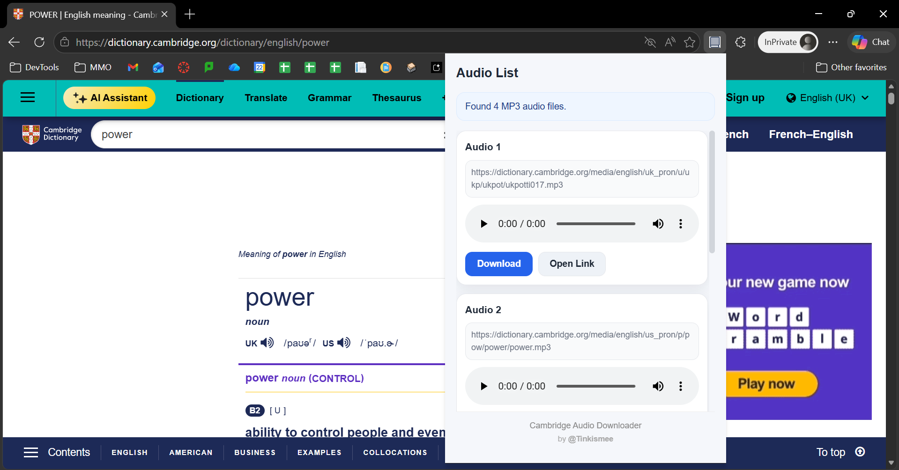
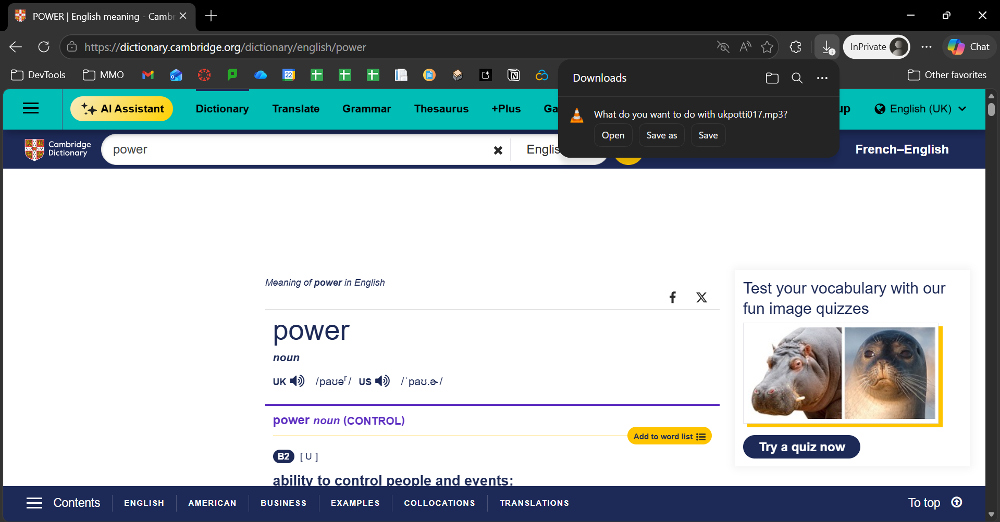

# Cambridge Dictionary Audio Downloader


> A lightweight Chrome Extension to extract and download MP3 audio from Cambridge Dictionary pages.

---

## 📑 Table of Contents

- [✨ Features](#-features)
- [🚀 Installation](#-installation)
- [🧠 How to Use](#-how-to-use)
- [📌 Notes](#-notes)

---

## ✨ Features

- 🔍 Automatically scans Cambridge Dictionary pages
- 🎵 Extracts all available MP3 audio files
- ▶️ Built-in audio preview player
- ⬇️ One-click download

---

## 📸 Screenshots

<p align="center">
  
</p>
<p align="center">
  
</p>

---

## 🚀 Installation

### 🔹 Option 1: Using Git (For advanced user)

```bash
git clone https://github.com/tinkismeeee/Cambridge-Dictionary-Audio-Downloader.git
cd Cambridge-Dictionary-Audio-Downloader
```

### 🔹 Option 2: Download ZIP (For normal user)

1. Click **Code** → **Download ZIP**
2. Extract the ZIP file

Or download directly:
https://github.com/tinkismeeee/Cambridge-Dictionary-Audio-Downloader/archive/refs/heads/main.zip

---

### 🔧 Load Extension in Chrome

1. Open Chrome and go to:

```
chrome://extensions/
```

2. Enable **Developer mode** (top right)

3. Click **Load unpacked**

4. Select the extension folder

5. Enjoy! 🎉

---

## 🧠 How to Use

1. Open a word page on Cambridge Dictionary
   https://dictionary.cambridge.org

2. Click the extension icon

3. The extension will:
    - Scan the page
    - Display available audio files

4. Use:
    - ▶️ to preview
    - ⬇️ to download

---

## 📌 Notes

- For **educational purposes only**
- Do not use downloaded audio for commercial or unauthorized purposes

---

## 👤 Author

Created by [@Tinkismee](https://github.com/tinkismeeee)

---

# 🇻🇳 Tiếng Việt

> Extension Chrome giúp lấy và tải file MP3 từ Cambridge Dictionary nhanh chóng.

---

## ✨ Tính năng

- 🔍 Tự động quét trang Cambridge Dictionary
- 🎵 Lấy tất cả file MP3 trên trang
- ▶️ Nghe trực tiếp trong extension
- ⬇️ Tải xuống chỉ với 1 click

---

## 📸 Ảnh demo

<p align="center">
  
</p>
<p align="center">
  
</p>

## 🚀 Cài đặt

<!-- > ⚠️ Extension không có trên Chrome Web Store, cần cài thủ công. -->

### 🔹 Cách 1: Sử dụng Git (Dành cho người dùng nâng cao)

```bash
git clone https://github.com/tinkismeeee/Cambridge-Dictionary-Audio-Downloader.git
cd Cambridge-Dictionary-Audio-Downloader
```

### 🔹 Cách 2: Tải file ZIP (Dành cho người dùng thủ công)

1. Nhấn **Code** → **Download ZIP**
2. Giải nén file ZIP

Hoặc tải trực tiếp:
https://github.com/tinkismeeee/Cambridge-Dictionary-Audio-Downloader/archive/refs/heads/main.zip

---

### 🔧 Load Extension vào Chrome

1. Mở:

```
chrome://extensions/
```

2. Bật **Developer mode**

3. Nhấn **Load unpacked (Tải tiện ích chưa đóng gói)**

4. Chọn thư mục chứa extension vừa giải nén

5. Thưởng thức extension thôi 😚

---

## 🧠 Cách sử dụng

1. Mở từ bất kỳ trên Cambridge Dictionary
2. Click icon extension
3. Extension sẽ quét và hiển thị audio
4. Click:
    - ▶️ để nghe
    - ⬇️ để tải

---

## 📌 Ghi chú

- **Chỉ dùng cho mục đích học tập**
- Không sử dụng audio cho mục đích thương mại

---

## 👤 Tác giả

Phát triển bởi [@Tinkismee](https://github.com/tinkismeeee)
